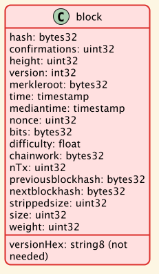
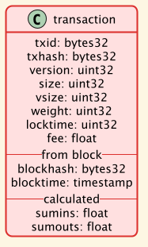
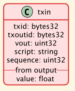
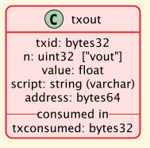

# Chain index of Bitcoin (BTC)

## Overview

The workflow consists of getting the block hashes for given block height:

`bitcoin-cli getblockhash 100000`

```json
000000000003ba27aa200b1cecaad478d2b00432346c3f1f3986da1afd33e506
```

and then, a dump of the block identified by its hash:

`bitcoin-cli getblock "000000000003ba27aa200b1cecaad478d2b00432346c3f1f3986da1afd33e506" 2`

(the 2 at the end returns the block info and all its transactions)

<details>
<summary>dump of a block in JSON</summary>

```json
{
  "hash": "000000000003ba27aa200b1cecaad478d2b00432346c3f1f3986da1afd33e506",
  "confirmations": 757497,
  "height": 100000,
  "version": 1,
  "versionHex": "00000001",
  "merkleroot": "f3e94742aca4b5ef85488dc37c06c3282295ffec960994b2c0d5ac2a25a95766",
  "time": 1293623863,
  "mediantime": 1293622620,
  "nonce": 274148111,
  "bits": "1b04864c",
  "difficulty": 14484.1623612254,
  "chainwork": "0000000000000000000000000000000000000000000000000644cb7f5234089e",
  "nTx": 4,
  "previousblockhash": "000000000002d01c1fccc21636b607dfd930d31d01c3a62104612a1719011250",
  "nextblockhash": "00000000000080b66c911bd5ba14a74260057311eaeb1982802f7010f1a9f090",
  "strippedsize": 957,
  "size": 957,
  "weight": 3828,
  "tx": [
    {
      "txid": "8c14f0db3df150123e6f3dbbf30f8b955a8249b62ac1d1ff16284aefa3d06d87",
      "hash": "8c14f0db3df150123e6f3dbbf30f8b955a8249b62ac1d1ff16284aefa3d06d87",
      "version": 1,
      "size": 135,
      "vsize": 135,
      "weight": 540,
      "locktime": 0,
      "vin": [
        {
          "coinbase": "044c86041b020602",
          "sequence": 4294967295
        }
      ],
      "vout": [
        {
          "value": 50.00000000,
          "n": 0,
          "scriptPubKey": {
            "asm": "041b0e8c2567c12536aa13357b79a073dc4444acb83c4ec7a0e2f99dd7457516c5817242da796924ca4e99947d087fedf9ce467cb9f7c6287078f801df276fdf84 OP_CHECKSIG",
            "desc": "pk(041b0e8c2567c12536aa13357b79a073dc4444acb83c4ec7a0e2f99dd7457516c5817242da796924ca4e99947d087fedf9ce467cb9f7c6287078f801df276fdf84)#40d2kraw",
            "hex": "41041b0e8c2567c12536aa13357b79a073dc4444acb83c4ec7a0e2f99dd7457516c5817242da796924ca4e99947d087fedf9ce467cb9f7c6287078f801df276fdf84ac",
            "type": "pubkey"
          }
        }
      ],
      "hex": "01000000010000000000000000000000000000000000000000000000000000000000000000ffffffff08044c86041b020602ffffffff0100f2052a010000004341041b0e8c2567c12536aa13357b79a073dc4444acb83c4ec7a0e2f99dd7457516c5817242da796924ca4e99947d087fedf9ce467cb9f7c6287078f801df276fdf84ac00000000"
    },
    {
      "txid": "fff2525b8931402dd09222c50775608f75787bd2b87e56995a7bdd30f79702c4",
      "hash": "fff2525b8931402dd09222c50775608f75787bd2b87e56995a7bdd30f79702c4",
      "version": 1,
      "size": 259,
      "vsize": 259,
      "weight": 1036,
      "locktime": 0,
      "vin": [
        {
          "txid": "87a157f3fd88ac7907c05fc55e271dc4acdc5605d187d646604ca8c0e9382e03",
          "vout": 0,
          "scriptSig": {
            "asm": "3046022100c352d3dd993a981beba4a63ad15c209275ca9470abfcd57da93b58e4eb5dce82022100840792bc1f456062819f15d33ee7055cf7b5ee1af1ebcc6028d9cdb1c3af7748[ALL] 04f46db5e9d61a9dc27b8d64ad23e7383a4e6ca164593c2527c038c0857eb67ee8e825dca65046b82c9331586c82e0fd1f633f25f87c161bc6f8a630121df2b3d3",
            "hex": "493046022100c352d3dd993a981beba4a63ad15c209275ca9470abfcd57da93b58e4eb5dce82022100840792bc1f456062819f15d33ee7055cf7b5ee1af1ebcc6028d9cdb1c3af7748014104f46db5e9d61a9dc27b8d64ad23e7383a4e6ca164593c2527c038c0857eb67ee8e825dca65046b82c9331586c82e0fd1f633f25f87c161bc6f8a630121df2b3d3"
          },
          "sequence": 4294967295
        }
      ],
      "vout": [
        {
          "value": 5.56000000,
          "n": 0,
          "scriptPubKey": {
            "asm": "OP_DUP OP_HASH160 c398efa9c392ba6013c5e04ee729755ef7f58b32 OP_EQUALVERIFY OP_CHECKSIG",
            "desc": "addr(1JqDybm2nWTENrHvMyafbSXXtTk5Uv5QAn)#70tf4ktg",
            "hex": "76a914c398efa9c392ba6013c5e04ee729755ef7f58b3288ac",
            "address": "1JqDybm2nWTENrHvMyafbSXXtTk5Uv5QAn",
            "type": "pubkeyhash"
          }
        },
        {
          "value": 44.44000000,
          "n": 1,
          "scriptPubKey": {
            "asm": "OP_DUP OP_HASH160 948c765a6914d43f2a7ac177da2c2f6b52de3d7c OP_EQUALVERIFY OP_CHECKSIG",
            "desc": "addr(1EYTGtG4LnFfiMvjJdsU7GMGCQvsRSjYhx)#t40fmm8a",
            "hex": "76a914948c765a6914d43f2a7ac177da2c2f6b52de3d7c88ac",
            "address": "1EYTGtG4LnFfiMvjJdsU7GMGCQvsRSjYhx",
            "type": "pubkeyhash"
          }
        }
      ],
      "fee": 0.00000000,
      "hex": "0100000001032e38e9c0a84c6046d687d10556dcacc41d275ec55fc00779ac88fdf357a187000000008c493046022100c352d3dd993a981beba4a63ad15c209275ca9470abfcd57da93b58e4eb5dce82022100840792bc1f456062819f15d33ee7055cf7b5ee1af1ebcc6028d9cdb1c3af7748014104f46db5e9d61a9dc27b8d64ad23e7383a4e6ca164593c2527c038c0857eb67ee8e825dca65046b82c9331586c82e0fd1f633f25f87c161bc6f8a630121df2b3d3ffffffff0200e32321000000001976a914c398efa9c392ba6013c5e04ee729755ef7f58b3288ac000fe208010000001976a914948c765a6914d43f2a7ac177da2c2f6b52de3d7c88ac00000000"
    },
    {
      "txid": "6359f0868171b1d194cbee1af2f16ea598ae8fad666d9b012c8ed2b79a236ec4",
      "hash": "6359f0868171b1d194cbee1af2f16ea598ae8fad666d9b012c8ed2b79a236ec4",
      "version": 1,
      "size": 257,
      "vsize": 257,
      "weight": 1028,
      "locktime": 0,
      "vin": [
        {
          "txid": "cf4e2978d0611ce46592e02d7e7daf8627a316ab69759a9f3df109a7f2bf3ec3",
          "vout": 1,
          "scriptSig": {
            "asm": "30440220032d30df5ee6f57fa46cddb5eb8d0d9fe8de6b342d27942ae90a3231e0ba333e02203deee8060fdc70230a7f5b4ad7d7bc3e628cbe219a886b84269eaeb81e26b4fe[ALL] 04ae31c31bf91278d99b8377a35bbce5b27d9fff15456839e919453fc7b3f721f0ba403ff96c9deeb680e5fd341c0fc3a7b90da4631ee39560639db462e9cb850f",
            "hex": "4730440220032d30df5ee6f57fa46cddb5eb8d0d9fe8de6b342d27942ae90a3231e0ba333e02203deee8060fdc70230a7f5b4ad7d7bc3e628cbe219a886b84269eaeb81e26b4fe014104ae31c31bf91278d99b8377a35bbce5b27d9fff15456839e919453fc7b3f721f0ba403ff96c9deeb680e5fd341c0fc3a7b90da4631ee39560639db462e9cb850f"
          },
          "sequence": 4294967295
        }
      ],
      "vout": [
        {
          "value": 0.01000000,
          "n": 0,
          "scriptPubKey": {
            "asm": "OP_DUP OP_HASH160 b0dcbf97eabf4404e31d952477ce822dadbe7e10 OP_EQUALVERIFY OP_CHECKSIG",
            "desc": "addr(1H8ANdafjpqYntniT3Ddxh4xPBMCSz33pj)#ejxdpym6",
            "hex": "76a914b0dcbf97eabf4404e31d952477ce822dadbe7e1088ac",
            "address": "1H8ANdafjpqYntniT3Ddxh4xPBMCSz33pj",
            "type": "pubkeyhash"
          }
        },
        {
          "value": 2.99000000,
          "n": 1,
          "scriptPubKey": {
            "asm": "OP_DUP OP_HASH160 6b1281eec25ab4e1e0793ff4e08ab1abb3409cd9 OP_EQUALVERIFY OP_CHECKSIG",
            "desc": "addr(1Am9UTGfdnxabvcywYG2hvzr6qK8T3oUZT)#te23gwt4",
            "hex": "76a9146b1281eec25ab4e1e0793ff4e08ab1abb3409cd988ac",
            "hex": "76a9146b1281eec25ab4e1e0793ff4e08ab1abb3409cd988ac",
            "address": "1Am9UTGfdnxabvcywYG2hvzr6qK8T3oUZT",
            "type": "pubkeyhash"
          }
        }
      ],
      "fee": 0.00000000,
      "hex": "0100000001c33ebff2a709f13d9f9a7569ab16a32786af7d7e2de09265e41c61d078294ecf010000008a4730440220032d30df5ee6f57fa46cddb5eb8d0d9fe8de6b342d27942ae90a3231e0ba333e02203deee8060fdc70230a7f5b4ad7d7bc3e628cbe219a886b84269eaeb81e26b4fe014104ae31c31bf91278d99b8377a35bbce5b27d9fff15456839e919453fc7b3f721f0ba403ff96c9deeb680e5fd341c0fc3a7b90da4631ee39560639db462e9cb850fffffffff0240420f00000000001976a914b0dcbf97eabf4404e31d952477ce822dadbe7e1088acc060d211000000001976a9146b1281eec25ab4e1e0793ff4e08ab1abb3409cd988ac00000000"
    },
    {
      "txid": "e9a66845e05d5abc0ad04ec80f774a7e585c6e8db975962d069a522137b80c1d",
      "hash": "e9a66845e05d5abc0ad04ec80f774a7e585c6e8db975962d069a522137b80c1d",
      "version": 1,
      "size": 225,
      "vsize": 225,
      "weight": 900,
      "locktime": 0,
      "vin": [
        {
          "txid": "f4515fed3dc4a19b90a317b9840c243bac26114cf637522373a7d486b372600b",
          "vout": 0,
          "scriptSig": {
            "asm": "3046022100bb1ad26df930a51cce110cf44f7a48c3c561fd977500b1ae5d6b6fd13d0b3f4a022100c5b42951acedff14abba2736fd574bdb465f3e6f8da12e2c5303954aca7f78f3[ALL] 04a7135bfe824c97ecc01ec7d7e336185c81e2aa2c41ab175407c09484ce9694b44953fcb751206564a9c24dd094d42fdbfdd5aad3e063ce6af4cfaaea4ea14fbb",
            "hex": "493046022100bb1ad26df930a51cce110cf44f7a48c3c561fd977500b1ae5d6b6fd13d0b3f4a022100c5b42951acedff14abba2736fd574bdb465f3e6f8da12e2c5303954aca7f78f3014104a7135bfe824c97ecc01ec7d7e336185c81e2aa2c41ab175407c09484ce9694b44953fcb751206564a9c24dd094d42fdbfdd5aad3e063ce6af4cfaaea4ea14fbb"
          },
          "sequence": 4294967295
        }
      ],
      "vout": [
        {
          "value": 0.01000000,
          "n": 0,
          "scriptPubKey": {
            "asm": "OP_DUP OP_HASH160 39aa3d569e06a1d7926dc4be1193c99bf2eb9ee0 OP_EQUALVERIFY OP_CHECKSIG",
            "desc": "addr(16FuTPaeRSPVxxCnwQmdyx2PQWxX6HWzhQ)#r33agg0y",
            "hex": "76a91439aa3d569e06a1d7926dc4be1193c99bf2eb9ee088ac",
            "address": "16FuTPaeRSPVxxCnwQmdyx2PQWxX6HWzhQ",
            "type": "pubkeyhash"
          }
        }
      ],
      "fee": 0.00000000,
      "hex": "01000000010b6072b386d4a773235237f64c1126ac3b240c84b917a3909ba1c43ded5f51f4000000008c493046022100bb1ad26df930a51cce110cf44f7a48c3c561fd977500b1ae5d6b6fd13d0b3f4a022100c5b42951acedff14abba2736fd574bdb465f3e6f8da12e2c5303954aca7f78f3014104a7135bfe824c97ecc01ec7d7e336185c81e2aa2c41ab175407c09484ce9694b44953fcb751206564a9c24dd094d42fdbfdd5aad3e063ce6af4cfaaea4ea14fbbffffffff0140420f00000000001976a91439aa3d569e06a1d7926dc4be1193c99bf2eb9ee088ac00000000"
    }
  ]
}
```
</details>

This gives a rough structure:

```
block: 000000000003ba27aa200b1cecaad478d2b00432346c3f1f3986da1afd33e506

tx: 8c14f0db3df150123e6f3dbbf30f8b955a8249b62ac1d1ff16284aefa3d06d87
  vin: coinbase
  vout 0: 50 @ scriptPubKey
tx: fff2525b8931402dd09222c50775608f75787bd2b87e56995a7bdd30f79702c4
  vin: 87a157f3fd88ac7907c05fc55e271dc4acdc5605d187d646604ca8c0e9382e03 vout:0
  vout 0: 5.56 @ scriptPubKey
  vout 1: 44.44 @ scriptPubKey
tx: 6359f0868171b1d194cbee1af2f16ea598ae8fad666d9b012c8ed2b79a236ec4
  vin: cf4e2978d0611ce46592e02d7e7daf8627a316ab69759a9f3df109a7f2bf3ec3 vout:1
  vout 0: 0.01 @ scriptPubKey
  vout 1: 2.99 @ scriptPubKey
tx: e9a66845e05d5abc0ad04ec80f774a7e585c6e8db975962d069a522137b80c1d
  vin: f4515fed3dc4a19b90a317b9840c243bac26114cf637522373a7d486b372600b vout:0
  vout 0: 0.01 @ scriptPubKey
```

* inputs to a transaction only contain a reference to an earlier output, so this requires a lookup with the "tx hash" and the "vout" index.

* outputs in transactions contain an index so they can be referenced later as inputs.

* the first transaction spends the miner's reward and all fees and is termed "coinbase". It has no input but only outputs.

* for performance reasons: best to use the REST API (default port 8332)

readings: https://developer.bitcoin.org/reference/transactions.html


## Schema

### Block



The identity is the block "hash".


### Transaction



The identity is the "txid".

A transaction points to its block: "blockhash".

The field "sumins" contains the sum of values in the inputs.

The field "sumouts" contains the sum of values in the outputs.

### Transaction Input



The identity is the triple: "txid", "txoutid", "vout".

A transaction input points to its transaction: "txid".

And, relates to an output: "txoutid", "vout".

We can copy over from the output its value.

### Transaction Output



The identity is the tuple: "txid", "n".

A transaction output points to its transaction.

Once consumed, the field "txconsumed" contains the txid of the transaction that this output is an input.


## Programs

The programs require the following environment variables to be defined:

* RPCUSER
* RPCSECRET
* RPCENDPOINT

(these point to the running _bitcoind_)

### List block hashes

```sh
dune exec bin/lsblocks.exe -- -s 12000 -n 10
```

will output

```sh
12000, "0000000011d1d9f1af3e1d038cebba251f933102dbe181d46a7966191b3299ee"
12001, "000000009bf236ddb082304d8ad0954cd3292792c4958b643f2ec3c1ac3f026b"
12002, "000000002265b70bfe04bd32c422aa04eb29e772211464e93dc218893fa5e99d"
12003, "0000000024c4608a5c2ae76e2188aab949ea895fcb3800d48db32c2de73c3e9b"
12004, "000000009b7046d59900dd75a91dfb0411a48be21198b7c908ab18495d5d4a87"
12005, "0000000045a447acf5ea6b56333ee6ffd6a7e5ce2a67342340e5bf3ddc8c1c76"
12006, "0000000001cdf36dc78cf5f1f486064a1c60d873f97ba3af9abc56e973ee1632"
12007, "0000000080088948c28ae3a808545e7e170d25027f50af3da9249831e414b5d7"
12008, "00000000a2d14165a587266aad50bf2d69e8f7b1d61dfa462a8e2087ff619126"
12009, "00000000b56dfd77b27446c5ce37b36136034e4de79eda1c1ba55f743e81a1ce"
```

### Dump block content and translate to SQL

The program can either read in a JSON file with argument `-f <filepath>`, or
send a POST request to _bitcoind_ for a blockheight and blockhash.

```sh
dune exec bin/json2sql.exe -- -n 0 -s 000000000019d6689c085ae165831e934ff763ae46a2a6c172b3f1b60a8ce26f
```

will generate the following SQL commands:

```sql
BEGIN;
INSERT INTO btc_txin (txid,txoutid,vout,sequence,coinbase) VALUES (
  decode('4a5e1e4baab89f3a32518a88c31bc87f618f76673e2cc77ab2127b7afdeda33b','hex'),
  decode('4a5e1e4baab89f3a32518a88c31bc87f618f76673e2cc77ab2127b7afdeda33b','hex'),
  -1,
  4294967295,
  '04ffff001d0104455468652054696d65732030332f4a616e2f32303039204368616e63656c6c6f72206f6e206272696e6b206f66207365636f6e64206261696c6f757420666f722062616e6b73' );

INSERT INTO btc_txout (txid,n,value,address) VALUES (
  decode('4a5e1e4baab89f3a32518a88c31bc87f618f76673e2cc77ab2127b7afdeda33b','hex'),
  0,
  50.000000,
  '4104678afdb0fe5548271967f1a67130b7105cd6a828e03909a67962e0ea1f61deb649f6bc3f4cef38c4f35504e51ec112de5c384df7ba0b8d578a4c702b6bf11d5fac' );

INSERT INTO btc_transaction (txid,blockhash,blocktime,version,size,vsize,weight,locktime,fee) VALUES (
  decode('4a5e1e4baab89f3a32518a88c31bc87f618f76673e2cc77ab2127b7afdeda33b','hex'),
  decode('000000000019d6689c085ae165831e934ff763ae46a2a6c172b3f1b60a8ce26f','hex'),
  to_timestamp(1231006505)::timestamp without time zone,
  1,
  204,
  204,
  816,
  0,
  NULL );

INSERT INTO btc_block (hash,confirmations,height,version,merkleroot,"time",mediantime,nonce,bits,difficulty,chainwork,ntx,previousblockhash,nextblockhash,strippedsize,size,weight) VALUES (
  decode('000000000019d6689c085ae165831e934ff763ae46a2a6c172b3f1b60a8ce26f','hex'),
  857809,
  0,
  1,
  decode('4a5e1e4baab89f3a32518a88c31bc87f618f76673e2cc77ab2127b7afdeda33b','hex'),
  to_timestamp(1231006505)::timestamp without time zone,
  to_timestamp(1231006505)::timestamp without time zone,
  2083236893,
  '1d00ffff',
  1,
  decode('0000000000000000000000000000000000000000000000000000000100010001','hex'),
  1,
  decode('','hex'),
  decode('00000000839a8e6886ab5951d76f411475428afc90947ee320161bbf18eb6048','hex'),
  285,
  285,
  1140 );

COMMIT;
```

## Queries

### PostgreSQL query for outputs on an address

```sql
SELECT txid, blockhash, blocktime, output FROM (
  SELECT tx.txid, tx.blockhash, tx.blocktime, jsonb_array_elements(tx.vout) AS output FROM btc_transaction AS tx
) AS subq
WHERE subq.output #>> '{scriptPubKey,address}' = '1H3AeABb5d1uvBaa8h6uPnmkGDR1y6wmoV';
```

### DuckDB query for accessing values in JSON

```sql
SELECT txid, list_transform(from_json(vout, '["json"]'), x -> json_extract(json(x), ['$.n','$.value','$.scriptPubKey.address'])) FROM btc_transaction offset 102080 LIMIT 20;
```

or, we can also query over a Parquet file:
```sql
SELECT txid, list_transform(from_json(vout, '["json"]'), x -> json_extract(json(x), ['$.n','$.value','$.scriptPubKey.address'])) FROM read_parquet('test_805100_100-tx.parquet');
```

outputs:
```
┌──────────────────────┬──────────────────────────────────────────────────────────────────────────────────────────────────────────────────────────────────────┐
│         txid         │                                                               outputs                                                                │
│         blob         │                                                               json[][]                                                               │
├──────────────────────┼──────────────────────────────────────────────────────────────────────────────────────────────────────────────────────────────────────┤
│ \xD42414ad47a22358…  │ [[0, 0.21, "1HBdM234dvysrQExy9JszAbAfDPbHHfSAd"], [1, 0.00189368, "bc1qa9w4zee2gkgzkeys7sh4jwqphr46cea9w2fkk9"]]                     │
│ \x10e8250b3b477f97…  │ [[0, 0.00000546, "bc1qntud2mawrk7r37dq2xmuyl43stmulqcu49q3q9"]]                                                                      │
│ \x040a21758a12e4cf…  │ [[0, 0.00000546, "bc1qntud2mawrk7r37dq2xmuyl43stmulqcu49q3q9"]]                                                                      │
│ \xCDed4a35242e9c20…  │ [[0, 0.00000546, "bc1qntud2mawrk7r37dq2xmuyl43stmulqcu49q3q9"]]                                                                      │
│ \xCFd78c32de713091…  │ [[0, 0.00000546, "bc1qntud2mawrk7r37dq2xmuyl43stmulqcu49q3q9"]]                                                                      │
│ \xA5388cf2d7f4816a…  │ [[0, 0.00000546, "bc1qntud2mawrk7r37dq2xmuyl43stmulqcu49q3q9"]]                                                                      │
│ Yee98ec78230b73652…  │ [[0, 0.00000546, "bc1qntud2mawrk7r37dq2xmuyl43stmulqcu49q3q9"]]                                                                      │
│ \xA78d5a8514348b6f…  │ [[0, 0.00000546, "bc1qntud2mawrk7r37dq2xmuyl43stmulqcu49q3q9"]]                                                                      │
│ nec96c7f36f5372231…  │ [[0, 0.00000546, "bc1qntud2mawrk7r37dq2xmuyl43stmulqcu49q3q9"]]                                                                      │
│ j8fe9a27be4e2be090…  │ [[0, 0.00004201, "bc1pryemxv0s42h522lw099tghrzm08enxe3kwzs3sk4qjpeg8vmrnqs9audwa"], [1, 0.02546404, "bc1qf75uznflm5s9559zgxae5jawm…  │
│ .9019c51e63953b6c5…  │ [[0, 0.0000421, "bc1pcfkw0tc8ahe36yquchtamf0hjgn8m3e2xv9cdhh5upnqpl9jl3uq43xp3z"], [1, 0.00261734, "bc1qrxjvglhn0s8j8r7e4uqecerwwd…  │
│ \x7F94a414d5f7f3c4…  │ [[0, 0.0000421, "bc1pqr7r96trnsj06wdzcrv4gjku3277zdl2k588g768sxxd7qqnh3nqlzd4we"], [1, 0.0025614, "bc1qrxjvglhn0s8j8r7e4uqecerwwd9…  │
│ .d8674ac646bac64e5…  │ [[0, 1.03296099, "bc1q538rrc4ahsrxaftl2xa7qwm0fztwckqugtu8wt"]]                                                                      │
│ \x9Eaddeb34822b575…  │ [[0, 0.03460844, "bc1pwayuhsfyx2l8q98v4hxn6hdxddg57f4dpnnlmesvj6mczysc005qkn46cx"], [1, 0.0334387, "bc1qkck7nwuuje9hqh5k3l8gcmzzqh…  │
│ cbc3f8dafdffefb2f4…  │ [[0, 0.00038855, "bc1q4yuffq8dy5z54428wvktmkvp3lf7h62exd4qkj2p7yvqtpdpnq3q2x3cs4"], [1, 0.01960121, "bc1qye8wmq42ey06z3wzyvqejdfyl…  │
│ -6091ddfbd227a3987…  │ [[0, 0.00037618, "bc1pe3dz3wt8t26jle9e2467qn649zc9axzp9u48x85dlz3t6auesfpqzw5mfe"]]                                                  │
│ ~d77933c781f8572b0…  │ [[0, 0.0003775, "bc1qt9fjn5xgsg0xj2yj3l0a7557tskjqdgntj7l6t"]]                                                                       │
│ \xACc559f85c0cdb43…  │ [[0, 0.03775627, "3AACETp6XAsQ6yoSqaAgKdwJp1uLYdKfzd"], [1, 0.00038138, "39BssXyaMFLntkzfZQ4o8CS4JiWDKBAypB"], [2, 0.00006173, "39…  │
│ \x82c1501b2e5ab8ae…  │ [[0, 0.000012, "bc1p9h459lj9cdhw3uky9x0kdp5ccm7n4q7jkkmws78gvxr7l5asldxqmqvnu7"], [1, 0.0001, "bc1p9h459lj9cdhw3uky9x0kdp5ccm7n4q7…  │
│ \xC2759cd08e32256f…  │ [[0, 0.000012, "bc1p9d8ds2mptpzsegh457u4tvt07g70wktpc2q95me3437rdd3fxtxq0at2kn"], [1, 0.0001, "bc1p9d8ds2mptpzsegh457u4tvt07g70wkt…  │
├──────────────────────┴──────────────────────────────────────────────────────────────────────────────────────────────────────────────────────────────────────┤
│ 20 rows                                                                                                                                           2 columns │
└─────────────────────────────────────────────────────────────────────────────────────────────────────────────────────────────────────────────────────────────┘
```

## Installation

### OCaml preparation

get the compiler and environment setup:
```sh
opam init --bare
opam switch create default 5.1.1
```

then, add some libraries:
```sh
opam install dune utop
opam install lwt_ppx
opam install yojson
opam install ezcurl-lwt
```

the code can then be compiled:

```sh
dune build
```

## Maintenance

### Insert pack of blocks into PostgreSQL

```sh
./lsblocks.sh -s 805000 -n 100 | ./json2pg.sh | psql -qb
```

### Transform a number of blocks to SQL and store in DuckDB

```sh
./lsblocks.sh -s 805000 -n 100 | ./json2duckdb.sh test_805000_100.db
```


### Delete a block and all its transactions from the database

```sh
BLOCKHEIGHT=200000

for Txid in $(cat data/${BLOCKHEIGHT}.json| jq -r '.result | .tx .[].txid '); do echo "DELETE FROM btc_txin WHERE txid=decode('${Txid}','hex'); DELETE FROM btc_txout WHERE txid=decode('${Txid}','hex'); DELETE FROM btc_transaction WHERE txid=decode('${Txid}','hex');" | psql; done

echo "DELETE FROM btc_block WHERE height=${BLOCKHEIGHT};" | psql
```
